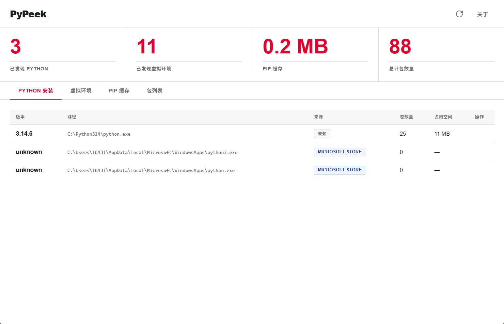
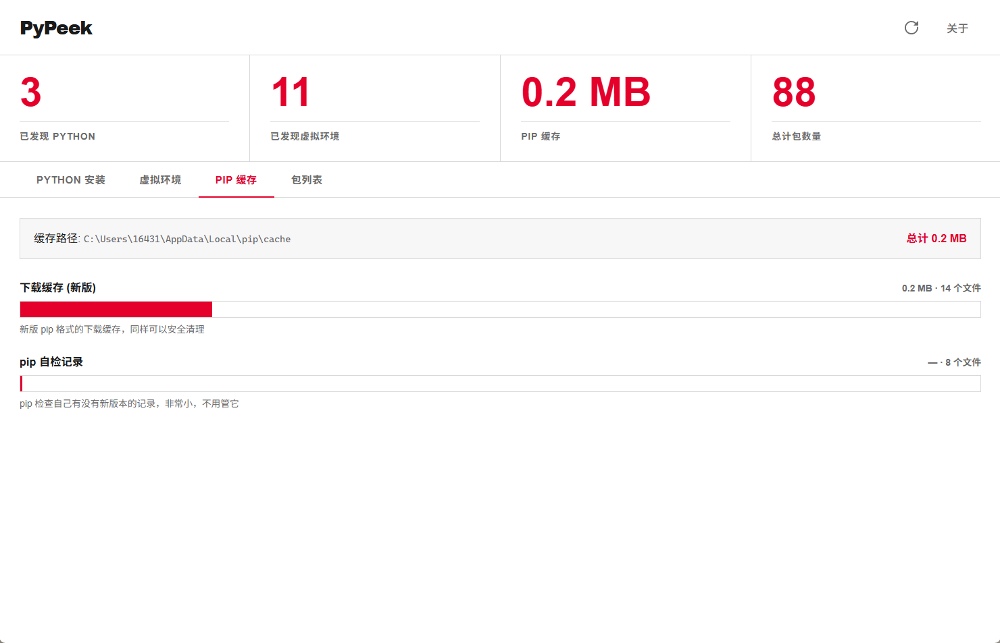
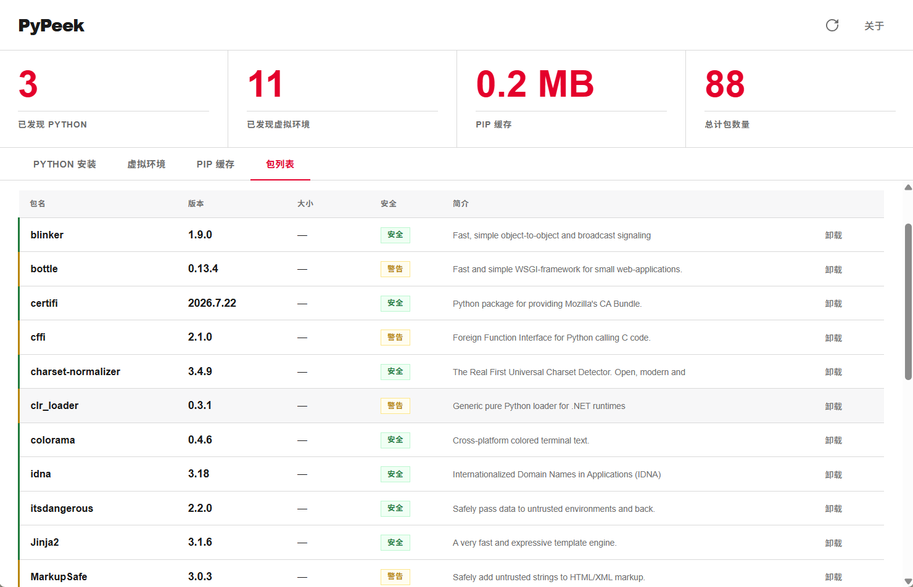
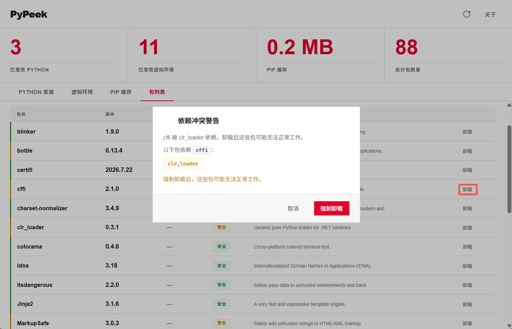

# PyPeek

Python 环境桌面浏览器：双击即开，一眼看全 Windows 机器上所有 Python 安装、虚拟环境和 pip 缓存。安全清理，不用碰终端。

> 目前处于测试阶段，部分功能未实现。

## 功能概览

- **Python 发现**：PATH 扫描 + Windows 注册表双重查找，识别 python.org、Microsoft Store、Conda 等安装来源，同版本多实例自动标记重复
- **虚拟环境发现**：全盘搜索 `pyvenv.cfg`，列出路径、Python 版本、磁盘占用、包数量、最后修改时间，自动跳过系统目录
- **pip 缓存分析**：分类展示下载缓存、本地编译缓存、自检记录，柱状图可视化各分类占用占比
- **包浏览器**：点击 Python 或 venv 行展开包列表，包名、版本、大小、简介一目了然，安全等级标注
- **安全卸载**：三级安全分级（安全 / 依赖冲突警告 / 系统关键禁止），卸载前 dry-run 预览，依赖冲突弹窗列明影响范围，强制卸载需显式确认
- **虚拟环境删除**：三道检查（pyvenv.cfg 验证、符号链接拒绝、删后目录存在性验证），安全兜底
- **SSE 实时进度**：扫描进度通过 Server-Sent Events 推送，前端实时渲染，无需轮询

## 项目运行截图

> 当前版本仅支持 Windows 平台及 pip 包管理。


*Python 安装发现 — Swiss 设计系统，统计卡片 + 数据表格*


*pip 缓存柱状图 — 分类展示下载/编译/自检缓存占用*


*包浏览器 — 安全等级标注，点击行展开*


*卸载警告弹窗 — 依赖冲突提示，需强制确认*

## 技术栈

Python 3.10+ 标准库（`http.server.ThreadingHTTPServer`）+ pywebview 桌面外壳 | 前端纯 HTML/CSS/JS，零框架，零构建工具 | Swiss 设计系统（Helvetica Neue + Swiss Red + 1px hairline grid）

## 快速开始

**要求**：Windows 10 或 11，Python 3.10 以上已安装。

```bat
git clone git@github.com:Kevin-Gao05/PyPeek.git
cd PyPeek
start.bat
```

首次运行自动安装 `pywebview`，随后弹出桌面窗口。

**Linux/macOS 本地调试（无 GUI）**：

```bash
python3 -c "from server.app import create_app; create_app().run()"
# 打开 http://127.0.0.1:8080
```

## 项目结构

```
main.py                   入口：启动 HTTP 服务 + pywebview 窗口
start.bat                 Windows 双击启动脚本
scanner/
  pythons.py              Python 安装发现（PATH + 注册表）
  venvs.py                虚拟环境发现（pyvenv.cfg 全盘搜索）
  pip_cache.py            pip 缓存分析与分类
  site_packages.py        包详情、安全分级、卸载执行
  cache.py                本地扫描结果缓存
server/
  app.py                  HTTP 路由、REST API、CORS
  sse.py                  SSE 事件管理器（线程安全队列）
static/
  index.html              单页骨架 + 欢迎弹窗 + 卸载弹窗 + Toast
  style.css               Swiss 设计系统（CSS 变量驱动）
  app.js                  前端逻辑：SSE 消费、表格渲染、卸载流程、缓存清理
```

纯 Python 标准库，零 Web 框架依赖。前端纯 HTML/CSS/JS，无构建工具。扫描进度通过 SSE 实时推送。

## API

| 方法 | 路径 | 说明 |
|------|------|------|
| GET | `/api/health` | 健康检查 |
| GET | `/api/cache` | 返回本地缓存的扫描结果（`cached: false` 表示首次启动） |
| GET | `/api/scan` | 触发全量扫描，返回 `scan_id` |
| GET | `/api/scan/progress?scan_id=` | SSE 事件流（实时进度推送），`scan_complete` 含扫描摘要 |
| GET | `/api/pip-cache` | 返回当前 pip 缓存数据 |
| GET | `/api/packages?python_path=` | 获取指定 Python 环境的包列表 |
| POST | `/api/uninstall/preview` | 卸载前安全检查（dry-run），返回安全等级 |
| POST | `/api/uninstall` | 执行卸载，`{python_path, package, force?}` |
| POST | `/api/cache/clear/preview` | 预览缓存清理（dry-run），返回大小、文件数、风险提示 |
| POST | `/api/cache/clear` | 执行缓存清理，`{category_path, confirm}` 或 `{all: true, confirm}` |
| POST | `/api/open-folder` | 在资源管理器中打开指定路径 |
| POST | `/api/delete-venv` | 删除虚拟环境（含安全校验） |

### 卸载流程

```
前端点击「卸载」
  → POST /api/uninstall/preview 获取安全等级
    → safe：确认弹窗 → 用户确认 → POST /api/uninstall
    → warning：依赖冲突弹窗（列 required_by）→ 用户确认 → POST /api/uninstall {force: true}
    → danger：禁止弹窗，按钮禁用，后端返回 403
  → 成功后自动刷新包列表 + Toast 提示
```

### 安全等级定义

| 等级 | 条件 | 行为 |
|------|------|------|
| `safe` | 无已知依赖 | 确认后可卸载 |
| `warning` | 其他包声称依赖此包 | 弹窗列依赖者，需强制卸载确认 |
| `danger` | pip / setuptools / wheel / pkg_resources | 前端按钮禁用 + 后端 403，无条件拒绝 |

## 安全措施

- **参数注入防护**：所有传给 pip 的包名前加 `--` 分隔符
- **路径校验**：`python_path` 做可执行文件名校验（白名单机制）
- **删除保护**：删除 venv 前检查符号链接、验证 pyvenv.cfg、确认目录删干净
- **路径穿越防护**：静态文件服务拒绝 `..` 和绝对路径
- **并发控制**：扫描操作全局锁，同一时间只允许一个扫描
- **CORS 限制**：仅允许 `127.0.0.1` 和 `localhost` 来源
- **双重安全检查**：前端 preview + 后端 force 标志，系统关键包无论如何无法卸载

## 已知限制

- 仅支持 Windows（pywebview 桌面窗口），Linux/macOS 仅可本地调试 Web 界面
- 不检查项目级 `requirements.txt` 或 `pyproject.toml` 中的依赖声明
- 卸载仅执行 `pip uninstall`，不清理用户脚本或配置文件
- Conda 环境发现暂未实现（`scanner/conda.py` 为占位）
- 不支持批量卸载
- 无深色/浅色主题切换（当前为 Swiss 浅色主题）

## 更新日志

### V1.1.0 (2026-08-04)

本批次合并 3 张 ticket，聚焦 V2 UX 增强 — 启动体验和缓存管理。

**新增**
- 本地扫描缓存（`scanner/cache.py`）— 扫描结果保存到 `~/.config/PyPeek/cache.json`，二次启动直接加载，无需等待扫描
- 首次启动欢迎弹窗 — 隐私说明 + 扫描范围预览，「开始扫描」/「稍后再说」两个入口
- 扫描摘要行 — 扫描完成后实时显示盘符、文件数、耗时
- pip 缓存分类清理 — 每个分类「清理」按钮 + 总览区「清理全部缓存」
- `GET /api/cache` — 返回缓存数据及 `cached` 标识
- `GET /api/pip-cache`、`POST /api/cache/clear/preview`、`POST /api/cache/clear` — 缓存清理 API

**改进**
- `scan_complete` SSE 事件新增 `scan_summary` 字段

**修复**
- pip 缓存清理后 UI 刷新不完整问题

### V1.0.0 (2026-08-03)

初始发布。

- Python 安装发现：PATH + Windows 注册表，识别 python.org / Microsoft Store / Conda 来源，同版本标记重复
- 虚拟环境发现：全盘搜索 `pyvenv.cfg`，路径、版本、大小、包数量、最后修改时间
- pip 缓存分析：分类柱状图，展示下载缓存 / 本地编译 / 自检记录
- 包浏览器：可展开行，安全徽章（safe / warning / danger），pip show 批量富化
- 安全卸载：三级分级 + 依赖冲突弹窗 + 强制确认 + 路径校验 + 参数注入防护
- 虚拟环境删除：三道安全检查（pyvenv.cfg 验证、符号链接拒绝、删后存在性验证）
- SSE 实时进度：Server-Sent Events 推送扫描阶段和进度百分比
- Swiss 设计系统：Helvetica Neue + Swiss Red + 1px hairline，CSS 变量驱动
- 零 Web 框架：`ThreadingHTTPServer` + 纯 HTML/CSS/JS，无第三方依赖

## 参与

见 [CONTRIBUTING.md](CONTRIBUTING.md)。

## 许可证

MIT
